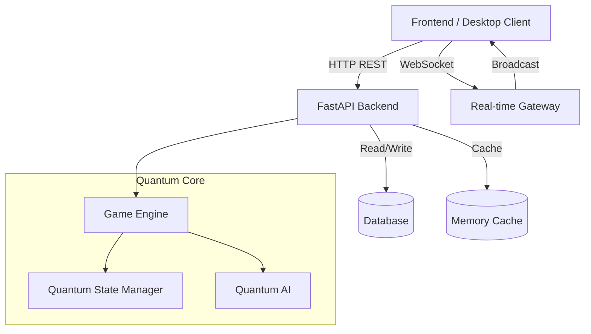
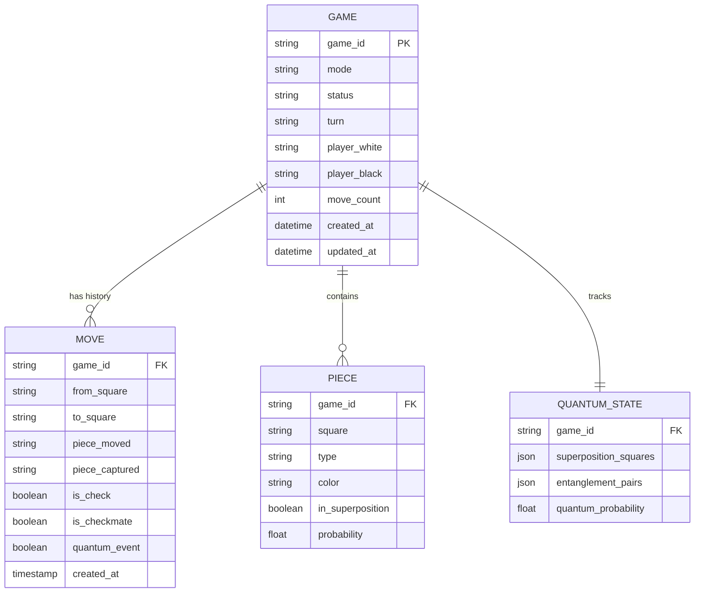
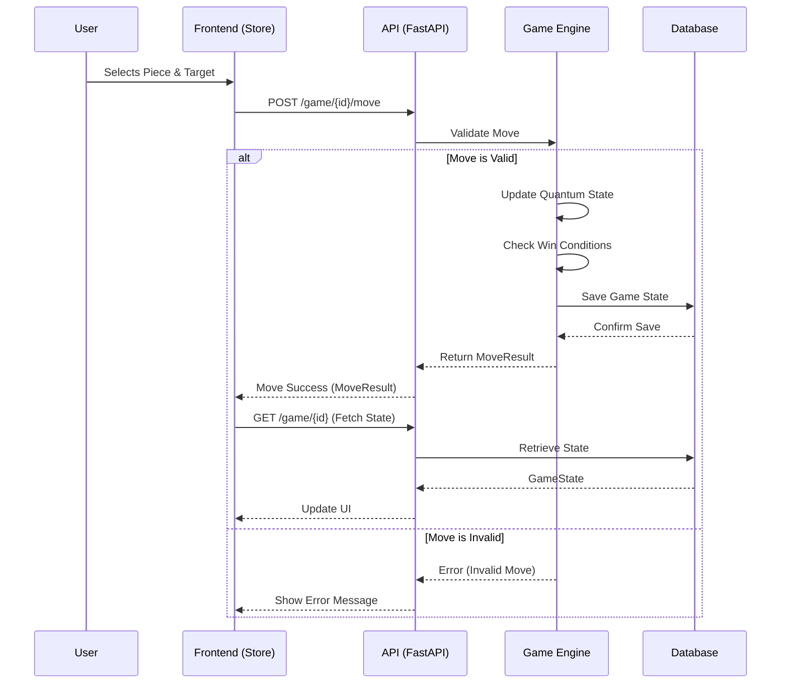

# Quantum Chess Ultimate

Quantum Chess Ultimate is a cutting-edge chess application that integrates quantum computing concepts into the classic game of chess. It features a robust Python backend powered by FastAPI, a modern React frontend with visualizations, and an Electron-based desktop application for a seamless native experience.

## Features

-   **Quantum Mechanics**: Experience chess with quantum superposition, entanglement, and interference.
-   **Real-time Multiplayer**: Play against others in real-time using WebSocket connections.
-   **Advanced AI**: Challenge an AI that leverages quantum probability distributions for decision making.
-   **Cross-Platform**: Available as a web application and a native desktop app for Windows, macOS, and Linux.
-   **Analysis Tools**: Visualize quantum states, probabilities, and game history.

## Technology Stack

### Backend
-   **Framework**: FastAPI (Python)
-   **Data Validation**: Pydantic
-   **Database**: SQLAlchemy / SQLModel (with Alembic for migrations)
-   **Real-time**: WebSockets
-   **Task Queue**: AsyncIO

### Frontend
-   **Framework**: React (Vite)
-   **Styling**: TailwindCSS & Framer Motion
-   **State Management**: Zustand
-   **HTTP Client**: Axios

### Desktop
-   **Wrapper**: Electron (TypeScript)
-   **Build Tool**: Electron Builder
-   **IPC**: Context Bridge & IPC Renderer

## System Architecture



## Database Schema (ER Diagram)

The following diagram represents the core data models used in the application.



## Data Flow Diagram

The following sequence diagram illustrates the flow of data when a player makes a move.



## Getting Started

### Prerequisites
-   Python 3.10+
-   Node.js 18+
-   npm or yarn

### Installation

1.  **Clone the Repository**
    ```bash
    git clone https://github.com/yourusername/quantum-chess-ultimate.git
    cd quantum-chess-ultimate
    ```

2.  **Backend Setup**
    ```bash
    cd backend
    python -m venv venv
    source venv/bin/activate  # On Windows: venv\Scripts\activate
    pip install -r requirements.txt
    ```

3.  **Frontend Setup**
    ```bash
    cd frontend
    npm install
    ```

4.  **Desktop Setup** (Optional)
    ```bash
    cd desktop
    npm install
    # Link local packages if necessary or ensure dependencies are met
    ```

### Running the Application

1.  **Start the Backend**
    ```bash
    # From backend directory
    uvicorn app.main:app --reload
    ```
    The API will be available at `http://localhost:8000`.

2.  **Start the Frontend**
    ```bash
    # From frontend directory
    npm run dev
    ```
    The web app will run at `http://localhost:5173`.

3.  **Run Desktop App**
    ```bash
    # From desktop directory
    npm run dev
    ```
    This will launch the Electron window loading the frontend.

## Project Structure

```
Quantum_Chess_Ultimate/
├── backend/            # Python FastAPI Backend
│   ├── app/
│   │   ├── api/        # REST API Routes
│   │   ├── core/       # Configuration & Security
│   │   ├── models/     # Pydantic & DB Models
│   │   └── services/   # Business Logic (Game, AI)
│   ├── tests/          # Pytest Suites
│   └── main.py         # Entry Point
│
├── frontend/           # React Web Application
│   ├── src/
│   │   ├── components/ # React Components
│   │   ├── services/   # API Clients
│   │   ├── store/      # Zustand State Management
│   │   └── types/      # TypeScript Definitions
│   └── vite.config.ts  # Vite Configuration
│
└── desktop/            # Electron Desktop App
    ├── electron/       # Main Process & Preload Scripts
    ├── dist/           # Built Binaries
    └── package.json    # Electron Dependencies
```

## License

This project is licensed under the MIT License.